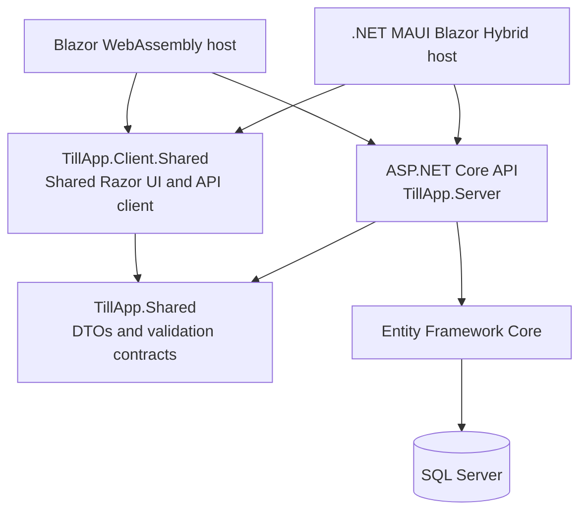

# TillApp

[](https://github.com/Assemessam/till-app/actions/workflows/ci.yml)

TillApp is a deliberately small, cross-platform point-of-sale and order-management portfolio application. It demonstrates a shared Blazor UI served through WebAssembly and .NET MAUI Blazor Hybrid, with an ASP.NET Core API that remains authoritative for catalog prices, order totals, and lifecycle rules.

## Screenshots and demo

Current screenshots are intentionally not committed: the earlier captures showed the retired static-catalogue and unpaid-only workflow. Capture the current UI using the concise checklist in [docs/SCREENSHOTS.md](docs/SCREENSHOTS.md), then add approved images under `docs/images/`.

Suggested review flow:

1. Start SQL Server, the API, and the WASM client.
2. Open the Dashboard and review the development seed catalogue in Catalog.
3. Create an order in New Order, using quantity controls in the POS cart.
4. Find it in Orders, then pay or cancel it while it is Pending.
5. Refresh Dashboard to see the current metrics and recent order list.

## Features

- Category and product management, including activation status.
- Shared POS order creation with category filtering, quantity-based cart controls, client total preview, and clear submission feedback.
- Server-calculated totals from current active product prices; the client submits product IDs and quantities only.
- Pending, Paid, and Cancelled order lifecycle with protected transitions.
- Order history, details, status/date/search filters, and recorded product-name and unit-price snapshots.
- Small daily dashboard with order counts, revenue, and recent orders.
- Consistent validation and non-sensitive `ProblemDetails` API errors.
- Development-only idempotent seed data, SQL Server Docker Compose setup, and real SQL Server integration tests.

## Technology stack

- .NET 10 / C# (SDK pinned in `global.json`)
- ASP.NET Core controller API and built-in OpenAPI
- Entity Framework Core 10 with SQL Server 2022 Express
- Blazor WebAssembly and .NET MAUI Blazor Hybrid (Android)
- Razor Class Library for shared client UI
- xUnit with ASP.NET Core integration testing
- Docker Compose for local SQL Server and GitHub Actions for build/test CI

## Architecture



The API is the central backend for both clients. EF entities, migrations, and business services remain server-only; request/response contracts live in `TillApp.Shared`; routable pages and presentation assets live in `TillApp.Client.Shared`.

### Project structure

| Project | Responsibility |
| --- | --- |
| `TillApp.Server` | ASP.NET Core API, EF Core entities/configuration/migrations, and business rules. |
| `TillApp.Client.WASM` | Browser host and browser-specific API configuration. |
| `TillApp.Client.MAUI` | Android MAUI host and emulator/device API configuration. |
| `TillApp.Client.Shared` | Shared Razor pages, API client, local UI state, and styles. |
| `TillApp.Shared` | API DTOs and validation contracts. |
| `TillApp.Server.Tests` | SQL Server-backed API/integration tests. |
| `TillApp.Client.Shared.Tests` | Shared client/API-client/component-state tests. |

## Getting started

The detailed, verified local workflow is in [docs/DEVELOPMENT.md](docs/DEVELOPMENT.md). In short:

```bash
cp .env.example .env
docker compose up -d sqlserver

set -a
source .env
set +a
export ConnectionStrings__TillApp="$TILLAPP_CONNECTION_STRING"

dotnet run --project TillApp.Server/TillApp.Server.csproj --launch-profile http
# In another terminal:
dotnet run --project TillApp.Client.WASM/TillApp.Client.WASM.csproj --launch-profile http
```

The API runs at `http://localhost:5080` and the WASM client at `http://localhost:5074`. In Development, the API applies pending migrations and safely adds only missing sample catalog data.

## Testing and CI

The shared-client suite has no SQL dependency:

```bash
dotnet test TillApp.Client.Shared.Tests/TillApp.Client.Shared.Tests.csproj
```

The server suite uses the disposable `TillAppTests` SQL Server database. Follow the safe environment setup in [docs/DEVELOPMENT.md](docs/DEVELOPMENT.md#run-tests), then run:

```bash
dotnet test TillApp.Server.Tests/TillApp.Server.Tests.csproj
```

The [CI workflow](.github/workflows/ci.yml) restores and builds the Server, shared client, and WASM projects; starts an isolated SQL Server container; and runs both test suites. MAUI Android is verified locally, rather than added to the Linux CI job, to keep the workflow focused and reliable.

## API / OpenAPI

In Development, the machine-readable OpenAPI document is available at:

```text
http://localhost:5080/openapi/v1.json
```

There is no interactive Swagger UI. The API covers categories, products, orders, and dashboard summary; endpoint metadata describes request validation and expected error responses.

## Design decisions

- **Server authority:** Product prices, availability checks, order totals, and status transitions are enforced by the API.
- **Historical accuracy:** Order lines retain product-name and unit-price snapshots, so later catalog changes do not rewrite history.
- **Shared cross-platform UI:** WASM and MAUI reuse the same Razor pages, styles, and API client while the hosts supply platform-specific configuration.
- **Small-scope architecture:** The application uses focused services and EF Core directly without extra repository/unit-of-work layers or service proliferation.

## Development

See [docs/DEVELOPMENT.md](docs/DEVELOPMENT.md) for Docker, configuration, migrations, OpenAPI, WASM, MAUI, and troubleshooting details.

## Scope and limitations

Authentication/authorization and production deployment configuration are intentionally outside this lightweight portfolio application's scope. The MAUI project targets Android; iOS/macOS builds require a Mac host and are not covered by CI.
